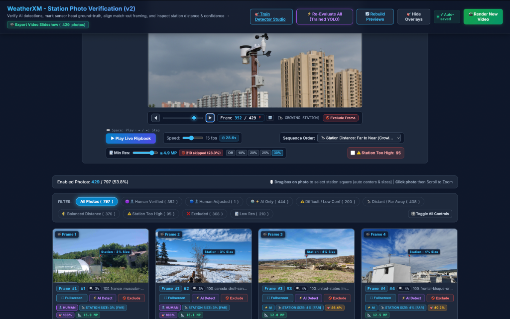
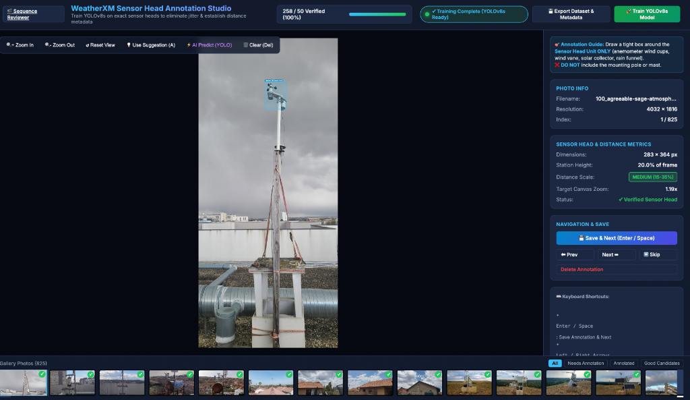
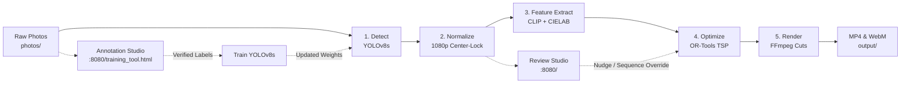

# WeatherXM Station Photo Verification (SPV) AI Detect & Match-Cut Studio

An end-to-end computer vision, annotation, and match-cut video production pipeline for **WeatherXM** community-installed weather stations.

It detects and locks station sensor heads to the exact center of a 1080p canvas, extracts multi-modal visual features (OpenAI CLIP + CIELAB color), solves an optimal transition sequence via Traveling Salesperson Problem (TSP), and renders smooth match-cut video montages across multiple resolutions and creative treatments—accompanied by local browser studios for curation, bounding box annotation, and custom model training.

---

## 📸 Interactive Web Studios

<p align="center">
  
  
</p>

| Studio | URL | Key Capabilities |
| :--- | :--- | :--- |
| **Sequence Reviewer & Flipbook Studio** | [`http://localhost:8080/`](http://localhost:8080/) | Live 1080p flipbook player, timeline scrubber with frame jump navigation, sequence presets (TSP, Far-to-Near, Day-to-Night), drag-to-select annotation, "Too High" station exclusion filter, real-time auto-saving, and multi-tier video export (1080p Master + 720p Web) with live FFmpeg progress telemetry and macOS Finder integration. |
| **Annotation & Training Studio** | [`http://localhost:8080/training_tool.html`](http://localhost:8080/training_tool.html) | Bounding box labeling for sensor head units, automatic distance classification (`CLOSE_UP` to `TOO_FAR`), dataset export, and in-browser YOLOv8 fine-tuning with live training curves and real-time GPU console. |

---

## 🌟 Major Features & Capabilities

### 1. Multi-Resolution Video Production & 5 Match-Cut Treatments
- **1080p Full HD Master Tier**: Native 1:1 pixel sampling from source frames at ~8,000 kbps MP4 (Apple Silicon `h264_videotoolbox` hardware-accelerated) and ~6,000 kbps WebM (`libvpx-vp9` CRF 20) for crisp fidelity during rapid match-cuts.
- **720p Web Streaming Tier**: Scaled to $1280 \times 720$ at 24 fps and ~1,000 kbps (dual MP4 + WebM VP9) with `-movflags +faststart` for universal browser compatibility and instant web buffering.
- **5 Creative Treatments**:
  - **Version A**: 3 frames per photo rhythmic beat (8 fps photo pace @ 24fps)
  - **Version B**: Hyper-speed match-cut (1 frame/photo @ 24fps)
  - **Version C**: Cinematic slow Ken Burns push-in (8 frames/photo — 2× slower than D with optimized bitrate)
  - **Version D**: Subtle push-in motion (Ken Burns zoompan, 4 frames/photo)
  - **Version E**: Fixed Station match-cut (2 frames/photo @ 24fps — 12 fps photo pace)

### 2. Export Video Modal with Real-Time Progress & Finder Integration
- **Interactive Treatment Tickboxes & Presets**: Checkboxes for Version A, B, C, D, and E with quick presets (`All`, `Only C`, `Only D`, `None`) allow rendering any subset of treatments (e.g. rendering only Version C for fast, targeted exports).
- **3-Tier Export Selector**: Render **Both Tiers**, **1080p Master**, or **720p Web (3 Parts)** with dynamic file counts and bitrate indicators adapting directly to the selected treatments.
- **Sub-Frame Progress Telemetry**: Live progress bar fed by FFmpeg `-progress` pipes displaying frame counts, overall percentage, and current encoding speed (e.g., `25.4x`).
- **Target Folder & Finder Integration**: Monospace path display of the export directory with click-to-copy and an instant **📂 Open in Finder** button (`POST /api/open_folder`).

### 3. Click-to-Navigate Frame Numbers & Bidirectional Scrubber
- **Clickable Scrubber Readout (`Frame X / Y [MODE]`)**: Clicking the frame badge in the player smoothly scrolls down to center that photo card in the gallery with an intense glowing cyan pulse border (`.card-target-pulse`) and focus.
- **Direct Frame Jump (`[🔢]` & Double-Click)**: Direct modal prompt to input any arbitrary frame number and jump instantly.
- **Reverse Card-to-Player Jump**: Clicking any photo in the gallery or its `🎬 Frame #` badge scrubs the flipbook preview player to that frame with zero unwanted page scroll jumping.
- **Screen-Locked Scrubbing**: Scrubbing the timeline slider or stepping single frames pauses playback and updates the preview canvas in real time while keeping the user's viewport locked on the preview player.

### 4. Sequence Presets & Smart Curation
- **Natural Distance Zoom Presets**:
  - `🔭 Far to Near (Growing Station)`: Orders photos with station tiny in the distance physically growing frame-by-frame using natural un-magnified 1:1 framing.
  - `🔍 Near to Far (Shrinking Station)`: Orders photos descending, starting massive and shrinking into the distance.
- **Balanced Distance Presets**:
  - `☀️ Day to Night (Balanced Distance)` & `🌙 Night to Day (Balanced Distance)`: Isolates photos in the balanced 10%–35% station height band, sorted strictly by brightness while excluding distant/close-up outliers.
- **Algorithmic TSP Flow**: Solves a Traveling Salesperson Problem minimizing visual shock across OpenAI CLIP semantic embeddings (25%), CIELAB color (55%), and brightness/sky composition (20%).
- **Edge / "Too High" Detection**: Photos with stations at the top edge are automatically flagged with `⚠️ TOO HIGH` and excluded from regular playback. A compact `⚠️ 95` toggle with mouse hover explanation allows previewing them independently.
- **Real-Time Auto-Save**: All photo exclusions, order selections, and card adjustments persist immediately in the background (`✓ Auto-saved`).

### 5. Precision Annotation & Protection Architecture
- **Direct Drag-to-Select**: Click and drag directly on any photo card to draw a station bounding box; auto-calculates zoom and offsets to center-lock to 40% height.
- **Minimalist Red Center Dot & Ultra-Thin Frame**: 4px red center dot and razor-thin transparent guide frame for crystal-clear sensor verification against complex backgrounds.
- **Clean Solid Black Padding**: Replaced mirror repeats on close-up photos with constant black borders, highlighted in previews with diagonal red zebra hazard stripes.
- **Dual Evaluation System (Human vs. AI)**: Independent tracking of AI detections and human verifications in metadata. Batch re-evaluations protect all human annotations (`🛡️ Protect Human Evaluations`).

---

## 🌿 Multi-Branch Git Architecture

The repository separates lightweight application code, heavy raw photos, and rendered video assets into specialized branches:

| Branch | Contents | Typical Size | Clone / Hydrate Command |
| :--- | :--- | :--- | :--- |
| **`main`** | Source code, web studios, metadata, configs, and fine-tuned YOLOv8s weights | ~23 MB | `git clone https://github.com/WeatherXM/spv-ai-detect.git` |
| **`data/photos`** | 826 high-resolution raw photos | ~841 MB | `git checkout origin/data/photos -- photos/` |
| **`data/videos`** | Rendered match-cut videos (1080p Master + 720p Web tiers, 20 files) | ~740 MB | `git checkout origin/data/videos -- output/` |

---

## 🚀 Quickstart: Local Setup & Rebuild

### 1. Clone & Hydrate Data

```bash
# 1. Clone the lightweight main branch
git clone https://github.com/WeatherXM/spv-ai-detect.git
cd spv-ai-detect

# 2. Pull raw photos from the data/photos backup branch
git checkout origin/data/photos -- photos/

# 3. (Optional) Pull pre-rendered video backups from data/videos
git checkout origin/data/videos -- output/
```

### 2. Environment Setup

```bash
# System dependency: Install FFmpeg for video rendering
brew install ffmpeg       # macOS
sudo apt install ffmpeg   # Ubuntu / Debian

# Python setup (Python 3.10+)
python3 -m venv .venv
source .venv/bin/activate
pip install -r requirements.txt
```

### 3. Launch Local Web Studios

```bash
python server.py 8080
# Open http://localhost:8080/ (Review Studio) or http://localhost:8080/training_tool.html (Annotation Studio)
```

### 4. CLI Pipeline Execution

```bash
# Run full 5-stage pipeline
python main.py --stage all

# Run video rendering with specific resolution tier
python main.py --stage render --resolution both   # Render 1080p + 720p (20 files)
python main.py --stage render --resolution 1080p  # Render 1080p Master only (10 files)
python main.py --stage render --resolution 720p   # Render 720p Web only (10 files)

# Fast parallel photo re-normalization across all CPU cores
python scripts/renormalize_all.py
```

---

## ⚙️ How It Works: The 5-Stage Pipeline



1. **Stage 1 — Detection (`pipeline/detector.py`)**: Locates the sensor head unit using the fine-tuned YOLOv8s model (`weights/weatherxm_sensor_head_best.pt`), with zero-shot YOLO-World v2 fallback.
2. **Stage 2 — Normalization (`pipeline/normalizer.py`)**: Centers each sensor head at `(50% width, 50% height)` and scales it to `40%` canvas height (or 1:1 natural scaling for distance zoom modes). Boundaries are padded with solid black borders (`cv2.BORDER_CONSTANT`). Flagged `is_too_high` photos are auto-excluded.
3. **Stage 3 — Feature Extraction (`pipeline/feature_extractor.py`)**: Computes a pairwise visual distance matrix balancing CIELAB color distributions (55%), CLIP semantic embeddings (25%), brightness/saturation (10%), and sky/ground composition (10%).
4. **Stage 4 — Sequence Optimization (`pipeline/sequence_optimizer.py`)**: Solves the smoothest transition path as a Traveling Salesperson Problem (TSP) using Google OR-Tools with 2-Opt local search fallback, or applies user-selected presets (zoom far-to-near, color gradient, etc.).
5. **Stage 5 — Video Rendering (`pipeline/video_renderer.py`)**: Renders hardware-accelerated MP4 (`h264_videotoolbox` / `libx264`) and WebM (`libvpx-vp9`) videos across 5 treatments and multiple resolution profiles (1080p & 720p) with live progress telemetry and non-blocking file logging.

---

## 📁 Repository Structure & Key Assets

| Path | Description | Role |
| :--- | :--- | :--- |
| [`photos/`](photos/) | 826 high-resolution raw photos | Backed up on **[`data/photos`](https://github.com/WeatherXM/spv-ai-detect/tree/data/photos)** branch |
| [`output/`](output/) | Rendered match-cut videos (1080p & 720p) | Backed up on **[`data/videos`](https://github.com/WeatherXM/spv-ai-detect/tree/data/videos)** branch |
| [`metadata/weatherxm_photos_metadata.json`](metadata/weatherxm_photos_metadata.json) | Master registry of all photos | Stores dual AI/human bounding boxes, distance tiers, and flags |
| [`metadata/training_annotations.json`](metadata/training_annotations.json) | Curated training annotations | 238 verified ground truth labels for YOLO fine-tuning |
| [`metadata/sequence.json`](metadata/sequence.json) | Algorithmic TSP playback sequence | Optimized playback order minimizing visual shock |
| [`metadata/sequence_override.json`](metadata/sequence_override.json) | Curated playback sequence | Active sequence overrides & sort presets from Review Studio |
| [`metadata/review_exclusions.json`](metadata/review_exclusions.json) | Reviewer exclusions catalog | Persistent record of user-excluded photos |
| [`weights/weatherxm_sensor_head_best.pt`](weights/weatherxm_sensor_head_best.pt) | Custom YOLOv8s weights | Fine-tuned detector weights (~21 MB) |
| [`pipeline/`](pipeline/) | Core computer vision modules | Detection, normalization, feature extraction, TSP solver, video renderer |
| [`review_tool.html`](review_tool.html) | Local Review & Flipbook Studio | Interactive sequence inspector, timeline scrubber, and render triggers |
| [`training_tool.html`](training_tool.html) | Local Annotation & Training Studio | Bounding box annotation, distance categorization, live training monitor |
| [`server.py`](server.py) | Local web server & API | Serves browser studios, handles normalization, and runs video render jobs |
| [`config.yaml`](config.yaml) | Configuration | Canvas dimensions, alignment targets, feature weights, resolution profiles |

